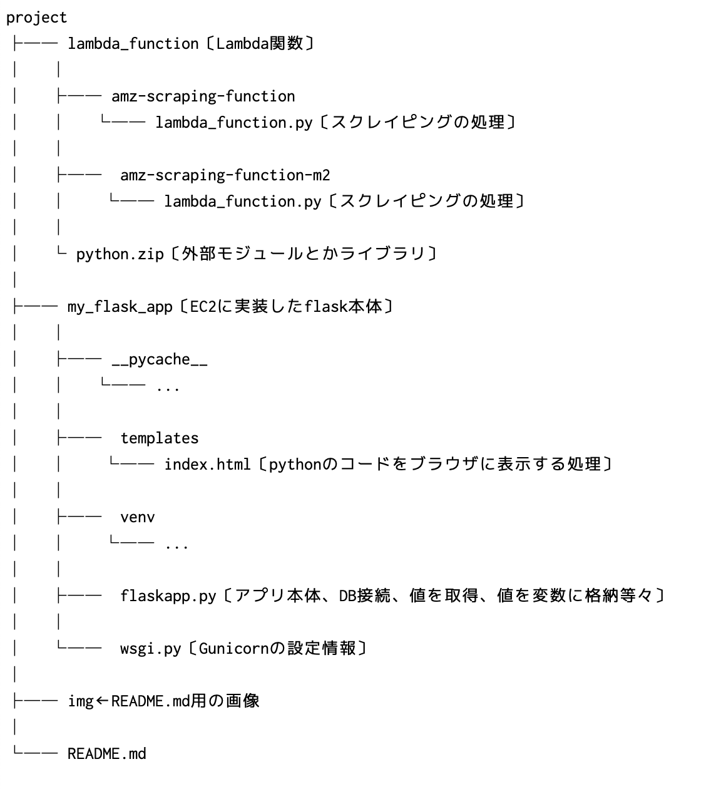

# ポートフォリオ【アマゾン在庫確認用システム試作初号】

## プロジェクトの概要
　  
**システムのURL:**  
<http://52.193.84.149>  
　  
**ディレクトリ構造**  
  
　  
このプロジェクトは、Amazonの在庫確認作業を効率化し、手間を省くことを目的としています。  
在庫の有無をブラウザからアクセスして確認できる  
簡単なWEBシステムを試作しました。  
　  
**スコープ**  
どこからでもWebブラウザからアクセスして任意のスクレイピングした商品が  
「価格情報が見つかりませんでした」でした、「より」で在庫の有無を確認さえできれば良い在庫がある商品が「より」という表示だったり細かい問題や改善点は少しづつ修正する  
上記のスコープにより永遠に完成しないという悲劇を免れた。  
　  
**成果物**  
Amazonの在庫が手間をかけずに在庫状況を簡単に把握できる。  
ブラウザを使用してどこからでも在庫が見られるようになった。  
　  
**タイムライン**  
プロジェクトの開始から完成までの期間は概ね2週間程度です。  
作業は休み日などに少しずつ進めた。    
　  
**リソース/チーム**  
リソース: AWS無料枠アカウントを利用した。  
チーム: このプロジェクトは一人で実施した。
ただし、コードの作成においてはChat-GPTにて作成した。  
　  
**成果期待値**  
プロジェクトの成功により、Amazon在庫確認にかかる時間と手間がなくなり、  
他のサービスの在庫確認などに時間を割くことができるようになった。  
　  
## プロジェクトのセットアップと実行手順
1.用意する物  
・AWSアカウントの作成  
　  
2.プロジェクトのセットアップ  
・空のLmabda関数を作成、作成した関数のロールに  
DynamoDBを操作するポリシーをアタッチする。  
　  
・StepFunctionにステートステートマシンを作成、  
ステートマシンに作成した関数を実装する。  
　  
・Lambda関数作成時にリモートリポジトリ「lambda_function」にある  
python.zipを先にアップロードする。※アップロードしないと
モジュールがないためLambda関数が動かない。  
　  
・アップロードした関数に手動でlambda_function.pyファイルを作成する。  
リモートリポジトリ「lambda_function/~/lambda_function.py」にある、
ソースをコピペして貼り付ける。  
　  
・EC2インスタンスの作成、作成したインスタンスの  
ロールにDynamoDBを操作するポリシーをアタッチする  
　  
・EC2インスタンスにSSH接続してEC2のuserディレクトリ直下に  
my_flask_appディレクトリをアップロードする。  
　  
・DynamoDBでテーブルを作成  
　  
・Event bridgeでスケジュールを作成。  
作成したスケジュールに関数が実行される。  
　  
以上  
　  
## 技術スタック  
・インフラサービス:AWS  
・スクレイピング:Lambda  
・Lambda関数:python  
・スケジュール:EventBridge  
・自動処理:Step Function  
・スクレイピングしたデータの保存:DynamoDB  
・サーバー用インスタンス:EC2  
・Webサーバー:nginx  
・アプリケーションサーバー:Gunicorn  
・Webアプリ用フレームワーク:Flask  
・HTMLエンジン用テンプレート:jinja2  
　  
**AWSシステム構成図**  
  

**DynamoDB/テーブルER図**  
  

**StepFunction/ステートマシーン図**  
  

## 参考情報
後日追記  

## 今後の予定
後日追記  
