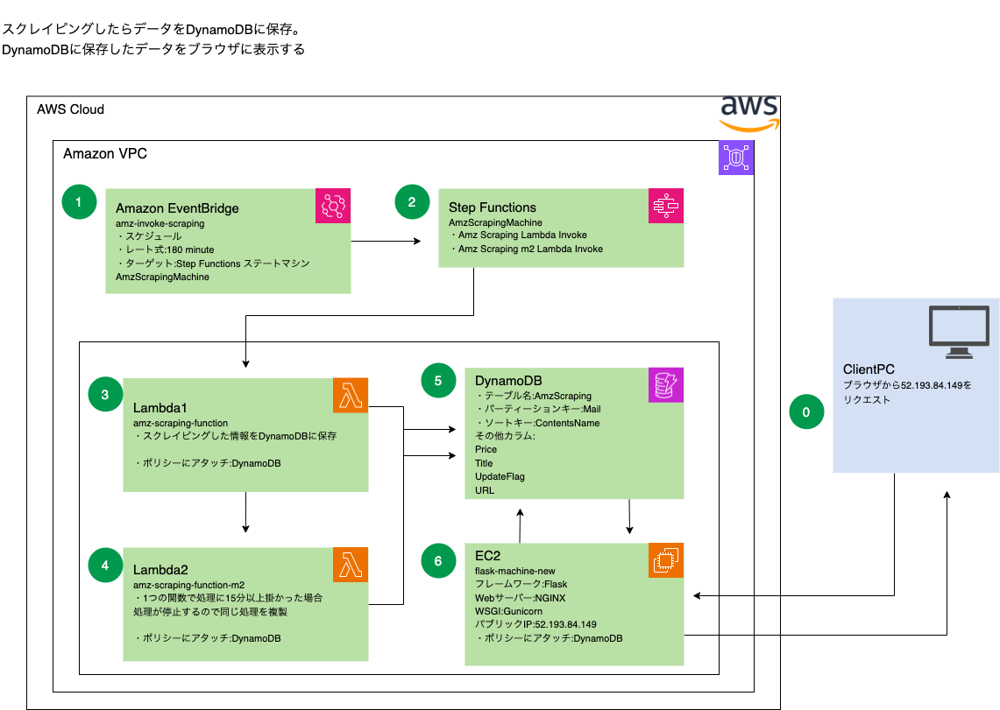
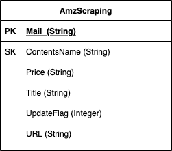
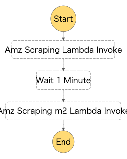

# ポートフォリオ【アマゾン在庫確認用システム試作初号】

# プロジェクトの概要

システムのURL: <http://52.193.84.149>

ディレクトリ構造
project
├── lambda_function〔Lambda関数〕
│   │
│   ├── amz-scraping-function
│   │   └── lambda_function.py〔スクレイピングの処理〕
│   │
│   ├──  amz-scraping-function-m2
│   │    └── lambda_function.py〔スクレイピングの処理〕
│   │
│   └ python.zip←〔外部モジュールとかライブラリ〕
│
├── my_flask_app〔EC2に実装したflask本体〕
│   │
│   ├── __pycache__
│   │   └── ...
│   │
│   ├──  templates
│   │    └── index.html〔pythonのコードをブラウザに表示する処理〕
│   │
│   ├──  venv
│   │    └── ...
│   │
│   ├──  flaskapp.py〔アプリ本体、DB接続、値を取得、値を変数に格納等々〕
│   │
│   └──  wsgi.py〔Gunicornの設定情報〕
│
├── img←README.md用の画像
│
└── README.md

このプロジェクトは、Amazonの在庫確認作業を効率化し、手間を省くことを目的としています。
在庫の有無を簡単に確認できるWebブラウザ上のシステムを開発しました。

**スコープ**
Webブラウザからアクセスして在庫の有無を一目で確認できる機能の実装
細かい問題や改善点は作業中に適宜修正する予定です。
上記のスコープにより、手間をかけずに商品の在庫状況を簡単に把握できるようになりました。

**成果物**
ブラウザからAmazonの在庫確認が可能となりました。
ユーザーは一目で商品の在庫の有無を確認できます。

**タイムライン**
プロジェクトの開始から完成までの期間は概ね2週間程度です。作業は休み時間などに少しずつ進められました。

**リソース/チーム**
リソース: AWS無料枠アカウントを利用しました。
チーム: このプロジェクトは一人で実施しました。
ただし、コードの作成においてはChat-GPTが多くの助力を提供しました。

**成果期待値**
プロジェクトの成功により、Amazon在庫確認にかかる時間と手間がなくなり、
他のサービスの在庫確認などに時間を割くことができるようになりました。

**プロジェクトのセットアップと実行手順**
1.用意する物
・AWSアカウントの作成

2.プロジェクトのセットアップ
・空のLmabda関数を作成、作成した関数のロールに
DynamoDBを操作するポリシーをアタッチする。

・StepFunctionにステートステートマシンを作成、
ステートマシンに作成した関数を実装する。

・Lambda関数作成時にリモートリポジトリ「lambda_function」にある
python.zipを先にアップロードする。※アップロードしないと
モジュールがないためLambda関数が動かない。

・アップロードした関数に手動でlambda_function.pyファイルを作成する。
リモートリポジトリ「lambda_function/~/lambda_function.py」にある、
ソースをコピペして貼り付ける。

・EC2インスタンスの作成、作成したインスタンスの
ロールにDynamoDBを操作するポリシーをアタッチする

・EC2インスタンスにSSH接続してEC2のuserディレクトリ直下に
my_flask_appディレクトリをアップロードする。

・DynamoDBでテーブルを作成

・Event bridgeでスケジュールを作成。
作成したスケジュールにスクリプトが実行される。

以上

**技術スタック**
・インフラサービス:AWS
・スクレイピング:Lambda
・Lambda関数:python
・スケジュール:EventBridge
・自動処理:Step Function
・スクレイピングしたデータの保存:DynamoDB
・サーバー用インスタンス:EC2
・Webサーバー:nginx
・アプリケーションサーバー:Gunicorn
・Webアプリ用フレームワーク:Flask
・HTMLエンジン用テンプレート:jinja2

*AWSシステム構成図*

*DynamoDB/テーブルER図*

*StepFunction/ステートマシーン図*

**機能と特徴の説明**
